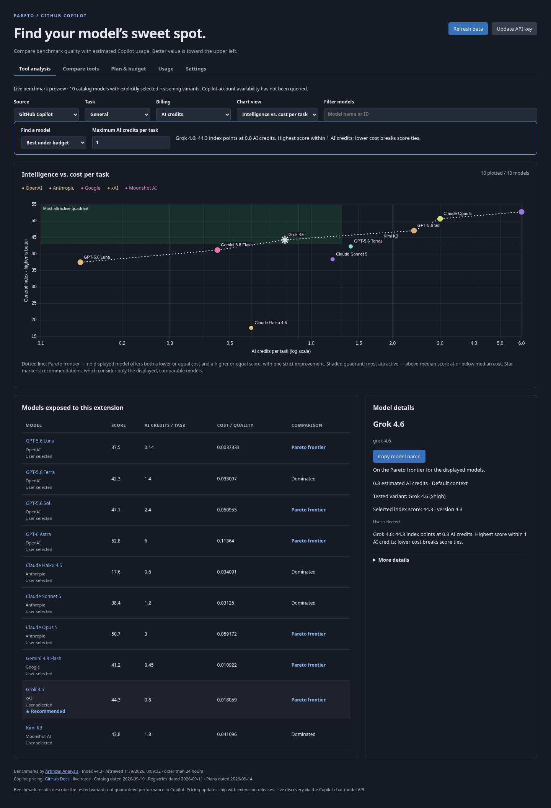

# Pareto GHC Comparator


A desktop VS Code extension for comparing the GitHub Copilot models exposed to your extension host. Pick a task and compare benchmark quality against estimated Copilot usage on a Pareto chart.

## Preview



Webview preview captured with live Artificial Analysis data. The ten catalog models and reasoning variants were selected explicitly for illustration; this preview does not represent a signed-in account's discovered Copilot availability. Benchmark scores and the data retrieval date appear in the extension.

## Install and use

1. Install VS Code 1.100 or newer and enable GitHub Copilot Chat. Sign in to an account with model access.
2. Run **Extensions: Install from VSIX…** and select `pareto-ghc-comparator.vsix`.
3. Run **Pareto GHC: Open Model Comparison** from the Command Palette.
4. Click **Set API key** and enter your own [Artificial Analysis Free API key](https://artificialanalysis.ai/data-api). The key is stored in VS Code SecretStorage, not settings or the webview.
5. Choose **Coding**, **General**, or **Agentic**, select a billing mode, and edit the illustrative token workload if needed.
6. Select a chart point or a model button in the table to inspect the tested variant and cost tradeoff. **Copy model name** lets you select that model in Copilot yourself.

An unmatched or ambiguous model stays in the table with an explanation. Model details show **Exact match**, **User selected**, **Needs selection**, or **Missing benchmark**. The searchable variant picker lists candidates from explicitly mapped model families, including alternate names used by Artificial Analysis. A single candidate resolves automatically; multiple reasoning variants require your choice.

Enable **Show other benchmarks for manual mapping** only when you need a benchmark outside the suggested family. Manual selections persist locally. **Use automatic matching** removes the override. If a selected variant disappears from the API, it stays unresolved until you choose a replacement or reset it; another variant is never substituted silently. A matching family does not verify Copilot's reasoning configuration. Models without verified pricing remain unpriced.

## Recommendations

The **Find a model** panel offers two modes using the currently filtered, available, comparable models:

- **Best under budget:** highest score at or below your maximum cost; lower cost breaks score ties. Each billing mode remembers its own budget, initially 1 AI credit or 1 premium request.
- **Cheapest near best:** lowest cost within an allowed score gap from the highest displayed score; higher score breaks cost ties. The default gap is 3 index points, not a percentage.

Exact ties remain recommended together. Star-shaped chart points and **★ Recommended** table labels identify recommendations separately from the Pareto frontier. The panel explains the winning score, cost, and threshold. Over-budget models stay visible for context. Missing data is excluded, and an explicit empty state explains when no model qualifies. Changes to filters, mappings, pricing inputs, or benchmark data recompute the recommendation.

## Saved workload profiles

Save named configurations across projects using the **Saved workload** controls. **Save as** creates and applies a profile from the current settings. Select an existing profile and click **Apply** to restore its task, billing mode, annual plan, token counts, recommendation mode, both budgets, and score gap.

Selecting **Custom** detaches the current workload from a saved profile without deleting it. Changing an applied profile marks it **Modified (not saved)**. **Update** explicitly overwrites that profile with the current workload. **Rename** uses the text in **Profile name**; **Delete** removes the selected profile while retaining the current workload. Names must be 1–60 characters after trimming and unique without regard to case.

Profiles live in VS Code extension global storage and are reusable across workspaces on that installation. They do not contain API keys, model mappings, model selections, or text filters. Applying a profile preserves the current filter. Existing v0.1 settings migrate to a **Custom** workload with recommendation defaults; caches and manual mappings are retained.

## Reading the chart

Higher scores and lower costs are preferred. The dotted line connects the Pareto frontier: models for which no displayed model has both an equal or lower cost and an equal or higher score, with at least one strict improvement. Tied models remain on the frontier. Filtering recomputes the comparison for the visible models. Points with missing data are excluded from the chart, with reasons shown in the table.

Positive costs use a logarithmic axis. If any comparable model has zero cost, the chart switches to a linear axis. The table supports keyboard selection and provides the same values as the chart. Light, dark, and high-contrast themes follow VS Code.

Each preset uses its published Artificial Analysis index directly; scores are not invented or blended into a custom ranking. The tested reasoning variant appears in the details. Benchmark scores are a proxy for task suitability, not a guarantee of performance with Copilot's configuration. Comparing a fixed token workload does not estimate how many tokens different models need to complete the same task.

## Billing estimates

**AI credits** estimates usage from GitHub's per-million-token USD rates, with 1 credit equal to $0.01. The default example has 1,000 uncached input and 1,000 output tokens, with no caching. Input buckets are disjoint: count each input token once as uncached, cache-read, or cache-write. Output includes reasoning tokens.

```
credits = (uncached × input_rate + cache_read × cached_rate
           + cache_write × write_rate + output × output_rate) / 10,000
```

Where no separate cache-write rate is listed, cache-write tokens use the normal input rate. Long-context thresholds apply to the sum of all three input buckets. Exactly reaching a threshold keeps the default tier; exceeding it uses the long-context rates for the complete workload. Workloads exceeding a model's reported input capacity are excluded. Expired promotional prices are excluded until the catalog is updated.

**Legacy premium requests** uses the published multiplier per manually selected model interaction for eligible annual Copilot Pro or Pro+ plans. The catalog currently has the same documented multipliers for both. Models without documented legacy multipliers remain unavailable in that mode. Auto-selection discounts, subscription charges, remaining allowances, code-review charges, and GitHub Actions costs are not included.

These figures describe estimated usage, not your account bill or measured task cost. No inference request is sent by this extension.

## Data, refresh, and privacy

- Benchmark source: [Artificial Analysis Free API documentation](https://artificialanalysis.ai/data-api/docs), `GET /api/v2/language/models/free`. All pages are fetched in the extension host, with a 20-second timeout per request.
- Pricing sources: [GitHub models and pricing](https://docs.github.com/en/copilot/reference/copilot-billing/models-and-pricing) and [legacy annual-plan multipliers](https://docs.github.com/en/copilot/reference/copilot-billing/request-based-billing-legacy/model-multipliers-for-annual-plans). Catalog date: **2026-09-10**.
- Benchmark snapshots are cached in the extension's global storage for 24 hours. **Refresh data** forces a refresh unless an API quota reset is pending. Cache replacement happens only after every page validates successfully.
- Offline, invalid-response, authentication, and rate-limit failures retain the last successful snapshot. The UI shows the retrieval date and identifies stale results. There is at most one automatic download attempt per extension session; manual refresh retries explicitly.
- The Free API documentation currently lists 100 requests per 24-hour window. Limits may change: the client observes `Retry-After`, `X-RateLimit-Remaining`, and `X-RateLimit-Reset`, and persists the next permitted request time.
- **Pareto GHC: Remove Artificial Analysis API Key** deletes the saved credential; it leaves the local benchmark cache available.
- No backend, telemetry, project-file reading, task uploads, or automatic model switching. Network access is limited to the benchmark API; model discovery uses the existing Copilot integration. The chart library and styling are bundled locally.

## Development

Use Node.js 22 or newer and npm. No API key is needed for automated tests. See [contributor guidance](AGENTS.md) for implementation details and validation requirements, [the changelog](CHANGELOG.md) for version history, and [the roadmap](docs/roadmap.md) for planned work.

```sh
npm ci
npm run check
npm test
npm run build
npx playwright install chromium
npm run test:ui
npm run package
npm run install:extension
```

Press **F5** to open an Extension Development Host after the build task runs. To use an existing Chromium installation for UI tests, set `PARETO_CHROMIUM_PATH` to its executable. To refresh the README preview from an already validated benchmark snapshot, run `node --import tsx scripts/capture-screenshot.mjs /path/to/snapshot.json`. The helper uses explicit illustrative variant selections and never accepts or stores an API key.

The packaged VSIX contains the compiled extension, webview assets, documentation, and dependency license notices. It does not include test fixtures or credentials.

Tests cover Pareto ties and dominance, filtering, missing data, pricing formulas and thresholds, expired promotions, exact and ambiguous mappings, API pagination and failures, cache retention, host/webview messages, secret isolation, recommendations and ties, profile persistence and migration, keyboard selection, and themed browser rendering. Browser tests use synthetic model data and a mocked host; a real-account smoke test still requires Copilot sign-in and an Artificial Analysis key.

## VS Code tasks and installation

Run **Tasks: Run Build Task** (`Ctrl+Shift+B`) for the default `build` task. **Tasks: Run Task** also offers:

| Task | Result |
| --- | --- |
| `build` | Compile the extension and webview. |
| `package` | Type-check, build, and generate `pareto-ghc-comparator.vsix`. |
| `install` | Package the current source, then install the VSIX into VS Code using `--force`. |

Run `npm ci` once before using the tasks. The install task requires the `code` command on PATH. On macOS, use **Shell Command: Install 'code' command in PATH**. Reload the VS Code window after updating the extension. For another VS Code profile or Insiders, run the package task and use that editor's **Extensions: Install from VSIX…** command.

The VSIX filename stays constant as versions change; the version inside it comes from `package.json`. `npm run install:extension` is the equivalent terminal command. It is deliberately separate from npm's dependency installation lifecycle.

## CI and Marketplace releases

`.github/workflows/extension.yml` runs on branch pushes, pull requests, version-tag pushes, and manual dispatch. It installs locked dependencies with Node.js 22, type-checks, runs the unit and host tests, builds, runs Chromium UI tests, and packages the VSIX. Successful runs upload a **pareto-ghc-comparator-<commit SHA>** artifact, retained for 30 days. Failed runs upload any browser diagnostics for 7 days.

Only a **push of a stable version tag** creates a GitHub Release and publishes to the VS Code Marketplace. The tag must exactly match `v` plus the manifest version, and the lockfile version must match too. The release job uploads the tested `pareto-ghc-comparator-<version>.vsix` to the tag's GitHub Release; the Marketplace job downloads the VSIX from that same run and publishes those exact packaged bytes. Branch pushes, pull requests, and manual dispatch only build artifacts.

As a first approach, install from the tag's GitHub Release (`Extensions: Install from VSIX…`) if the Marketplace job fails; the release job uploads the same tested bytes independently of Marketplace credentials. `vsce show kratos-multiphysics.pareto-ghc-comparator` currently lists version 0.5.1, so a 401 on a newer tag means the update upload was rejected, not that the pipeline built the wrong bytes.

One-time setup:

1. Register or select your publisher in [Marketplace publisher management](https://marketplace.visualstudio.com/manage/publishers/kratos-multiphysics). Set `publisher` in `package.json` to its exact ID. The current value is `kratos-multiphysics`; it must belong to an account you control.
2. Create the GitHub Actions environment **marketplace**. Add `VSCE_PAT` as an environment secret (a repository secret also works): an Azure DevOps PAT with organization **All accessible organizations**, scope **Marketplace → Manage**, a future expiration date, and an identity holding **Owner or Contributor** on that publisher. Reader access passes `vsce verify-pat` but publish then fails with 401. Do not put the token in source files. See the [official publishing guide](https://code.visualstudio.com/api/working-with-extensions/publishing-extension) for token creation and publisher membership.
3. Push this workflow to GitHub. No Artificial Analysis API key is needed in CI; automated tests use fixtures.

To release, start with a clean checkout, run `npm version patch` (or `minor` / `major`) to update both manifests and create a version commit and tag, then push the commit and **that specific tag**. For example, if the next version is `0.7.1`:

```sh
git push origin HEAD
git push origin v0.7.1
```

The repository manifest and lockfile are at version 0.7.0, with a corresponding git tag; `vsce show` lists 0.5.1 on the Marketplace, so the 0.7.0 Marketplace update is still pending a credential with write access. `npm run release:check -- v0.7.0` validates that tag string against both manifests; it does not verify git tag existence or publication. Use a new version for subsequent Marketplace releases. The workflow uses `--skip-duplicate` and does not overwrite an existing version; a failed publication can be rerun after fixing authentication.

Authentication maintenance: Microsoft's publishing guide states that global Azure DevOps PATs retire on December 1, 2026. This workflow verifies publisher access using `VSCE_PAT` when present and otherwise attempts `--azure-credential`. The fallback alone does not provision an Entra identity; configure and validate Microsoft Entra authentication before retiring PAT-based publication. The build and artifact jobs do not depend on publishing credentials.

## Maintaining the catalog

Update `src/catalog.ts` against the two GitHub sources, change `catalogDate`, and verify rates, thresholds, promotional expiry dates, and legacy plan availability. Rates are USD per million tokens; `null` cache-write rates mean normal input billing. Add only explicit Copilot IDs. Do not infer a pricing mapping from a similar family or display name.

`benchmarkFamilies` contains explicit model-family aliases. Matching allows a known family name followed by a reasoning qualifier; it does not fuzzy-match sibling model names. A single candidate may resolve automatically; multiple candidates require an explicit user selection. Preserve reasoning and fallback qualifiers. API response validation and the three index mappings live in `src/api.ts`; comparison and cost rules live in `src/compare.ts`. Keep new cases covered by tests, then build and package a new release. Full benchmark datasets are fetched using each user's key and are not bundled in the VSIX; the illustrated preview contains only its displayed scores.

## License

Extension code: MIT. Benchmarks: Artificial Analysis, subject to its API terms. Pricing: GitHub documentation. See `THIRD_PARTY_NOTICES.md` for bundled library licenses.
